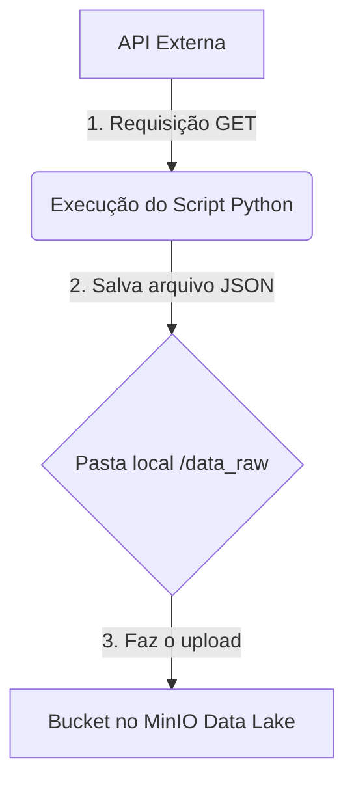

# DataConduit: Ingestor de API para MinIO


Um pipeline de ingestão de dados automatizado em Python, que coleta dados de uma API REST e os carrega em um Data Lake MinIO. Este projeto é um componente fundamental para criar a primeira camada (*Bronze Layer*) de uma arquitetura de dados moderna.

## 📖 Visão Geral

O objetivo deste projeto é automatizar o processo de **extração e carga (EL)** de dados. O script se conecta a uma fonte de dados (uma API pública, neste caso), baixa as informações em formato JSON e as armazena de forma segura e organizada em um bucket MinIO, que atua como nosso Data Lake.

## ✨ Funcionalidades

-   **Coleta Automatizada**: Busca dados de qualquer API REST que retorne JSON.
-   **Armazenamento Staging**: Salva os dados brutos localmente antes do upload, garantindo a integridade.
-   **Versionamento por Timestamp**: Cada arquivo coletado recebe um nome único com data e hora (`YYYYMMDD_HHMMSS`), evitando sobrescritas e facilitando o rastreamento.
-   **Upload Confiável**: Utiliza a biblioteca `s3fs` para uma comunicação eficiente e segura com o MinIO.
-   **Configuração Simples**: As credenciais e endpoints são facilmente configuráveis em um único local no script.

##  diagrama do Fluxo

O processo de ingestão segue um fluxo simples e linear:



## 🛠️ Tecnologias Utilizadas

-   **Python 3.10+**
-   **Requests**: Para realizar as chamadas HTTP para a API.
-   **s3fs**: Para interagir com o armazenamento de objetos MinIO de forma simples, como se fosse um sistema de arquivos local.

## 🚀 Começando

Siga os passos abaixo para configurar e executar o projeto em seu ambiente local.

### Pré-requisitos

-   Python 3 instalado.
-   Acesso a um servidor MinIO (com endpoint, bucket, access key e secret key).

### Instalação

1.  Clone o repositório:
    ```bash
    git clone https://github.com/SEU-USUARIO/NOME-DO-REPOSITORIO.git
    ```

2.  Navegue até o diretório do projeto:
    ```bash
    cd NOME-DO-REPOSITORIO
    ```

3.  Instale as dependências:
    ```bash
    pip install requests s3fs
    ```
    *(Opcional: Crie um arquivo `requirements.txt` com as bibliotecas `requests` e `s3fs` e rode `pip install -r requirements.txt`)*

### Configuração

Abra o arquivo `Upload-automatico-MINIO.py` e edite a seção `CONFIGURAÇÕES` com os dados do seu ambiente MinIO:

```python
# --- Configurações do Data Lake (MinIO) ---
MINIO_ENDPOINT = "https://seu-endpoint.minio.com"
MINIO_BUCKET_NAME = "nome-do-seu-bucket"
MINIO_ACCESS_KEY = "SUA_ACCESS_KEY"
MINIO_SECRET_KEY = "SUA_SECRET_KEY"
```

### Execução

Para iniciar o processo de ingestão, execute o script diretamente do seu terminal:

```bash
python Upload-automatico-MINIO.py
```

Você verá mensagens de log no console indicando o status de cada etapa do processo.

## 📂 Estrutura de Pastas

A estrutura do projeto é simples. A pasta `data_raw` é criada automaticamente pelo script na primeira execução.

```
/
│
├── Upload-automatico-MINIO.py    # O script principal de ingestão
│
└── data_raw/                     # Área de staging para os arquivos JSON baixados
    └── products_20231027_103000.json
```

## 💡 Possíveis Melhorias

Este projeto é um ponto de partida. Aqui estão algumas ideias para evoluí-lo:

-   **Containerização com Docker**: Empacotar a aplicação para facilitar o deploy.
-   **Orquestração**: Integrar com ferramentas como Airflow, Prefect ou Mage para agendar execuções recorrentes.
-   **Segurança**: Mover as credenciais do script para variáveis de ambiente ou um sistema de gerenciamento de segredos (como o Vault).
-   **Logging Avançado**: Implementar um sistema de logs mais robusto para monitorar execuções e depurar erros.
-   **Adicionar uma Camada de Transformação**: Incluir um passo de limpeza e transformação de dados (usando Pandas ou Polars) antes de carregar no MinIO.
